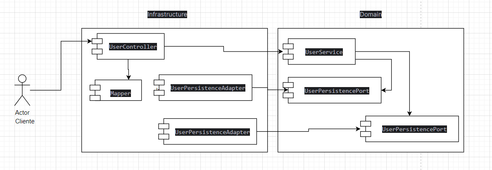

# API de Usuarios

## 🚀 Instalación

### Prerrequisitos
- Java 17+
- Gradle o Maven
- Docker (opcional para ejecutar la base de datos en un contenedor)

### Pasos de Instalación
1. Clona el repositorio:
   ```bash
   git clone https://github.com/MargaritaForex/nisum-project.git
   ```
2. Ingresa al directorio del proyecto:
   ```bash
   cd nisum-project
   ```
3. Construye el proyecto y ejecuta la aplicación:
   ```bash
   ./gradlew bootRun
   ```

---

## 📝 Endpoints

### Registro de usuario
**POST /api/users**
```json
{
  "name": "Juan Rodriguez",
  "email": "juan@rodriguez.org",
  "password": "hunter2",
  "phones": [
    {
      "number": "1234567",
      "citycode": "1",
      "contrycode": "57"
    }
  ]
}
```
**Respuestas:**
- **201 Created** - Usuario registrado exitosamente.
- **400 Bad Request** - Datos inválidos o email ya registrado.

### Obtener todos los usuarios
**GET /api/users**
- Retorna la lista de usuarios registrados.

### Buscar usuario por email
**GET /api/users/{email}**
- Retorna los datos del usuario correspondiente.
- **404 Not Found** si el usuario no existe.

### Actualizar usuario
**PUT /api/users/{email}**
- Permite actualizar la información del usuario.

### Eliminar usuario
**DELETE /api/users/{email}**
- Desactiva el usuario del sistema.

### Inicio de sesión
**POST /api/users/login**
```json
{
  "email": "juan@rodriguez.org",
  "password": "hunter2"
}
```
**Respuestas:**
- **200 OK** - Retorna el token JWT y la información del usuario.
- **401 Unauthorized** - Credenciales incorrectas.

---

## 🛠 Tecnologías Utilizadas
- **Java 17**
- **Spring Boot** (Spring Web, Spring Security, Spring Data JPA)
- **H2 Database** (Base de datos en memoria)
- **JWT** (JSON Web Token para autenticación)
- **Lombok** (Para reducir código boilerplate)
- **JUnit y Mockito** (Para pruebas unitarias)
- **Swagger** (Documentación de la API)

---

## 🧪 Pruebas
Para ejecutar las pruebas unitarias:
```bash
./gradlew test
```

---

## 📜 Documentación con Swagger
La API cuenta con documentación interactiva en Swagger UI.
- Una vez levantada la aplicación, accede a:
    - [http://localhost:8080/swagger-ui.html](http://localhost:8080/swagger-ui.html)

---

## 🗃 Base de Datos
La aplicación usa **H2** en memoria.
Puedes acceder a la consola de H2 en:
- [http://localhost:8080/h2-console](http://localhost:8080/h2-console)
- Credenciales:
    - **JDBC URL:** `jdbc:h2:mem:testdb`
    - **Usuario:** `sa`
    - **Contraseña:** (vacío)

---

## 📌 Notas Adicionales
- La API valida el formato del email con una expresión regular.
- La contraseña debe cumplir con requisitos definidos en configuración.
- JWT es almacenado y verificado para autenticación de usuarios.

---

## 📄 Diagrama de la Solución


---

## 📌 Collection postman
nisum-project\src\main\resources\Nisum-project.postman_collection.json"
